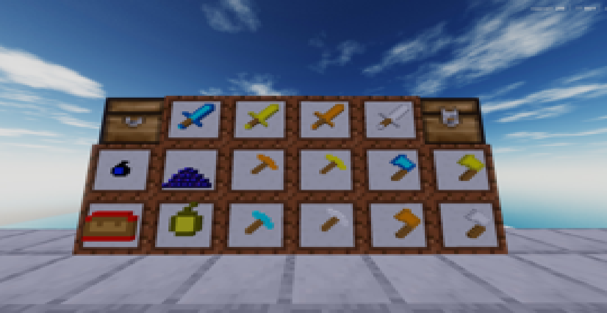

# ⚔️ Death-RP

### PvP Texture Pack for Luanti / Minetest

[](https://content.luanti.org/packages/Pryanilk/pryanilk_pack/)

**Death-RP** is a PvP-focused texture pack created for **Luanti (formerly Minetest)**, **Mineclonia**, and **MineClone2**.

The main goal of Death-RP is to provide a clean and recognizable visual style for PvP gameplay while still being suitable for regular survival and non-PvP servers.

> 🩸 **Made for PvP. Built for clarity.**

---

## 🏆 Credits

### Death-RP

Created and maintained by **Pryanilk**.

Death-RP is a personal PvP texture project that is continuously being expanded with new textures and improvements.

### CTF Textures

Some textures used for CTF content originate from **OrangeBlob's CTF HCTC** project:

https://gitlab.com/OrangeBlob/ctf_hctc

Please respect the original project's license and attribution requirements when using or redistributing those assets.

> ⚠️ Individual textures originating from other projects may have their own licenses and attribution requirements. Please check the credits and original project licenses before redistributing those assets separately.

---

## ✨ Features

* ⚔️ PvP-focused textures
* 🎯 Designed for FFA, CTF and other PvP servers
* 🌍 Support for Luanti / Minetest Game
* 🧱 Support for Mineclonia
* ⛏️ Support for MineClone2
* 🛡️ Custom armor textures
* ⚔️ Custom weapon textures
* 🔨 Custom tool textures
* 🌿 Multiple grass and vegetation variants
* 🍃 Transparent leaf variants
* 🖤 Custom obsidian textures
* 🌾 Custom farming textures
* 🎨 Multiple versions of selected textures
* 🔧 Easy to customize
* 📦 Separate textures for different games and servers

---

## 🎮 Supported Games & Servers

### Luanti / Minetest Game

Death-RP includes textures for the default Luanti / Minetest Game environment.

The pack includes various blocks, tools, weapons, farming items, vegetation and other game assets.

### Mineclonia / MineClone2

Death-RP also includes textures for **Mineclonia** and **MineClone2**, providing a PvP-oriented visual style for Minecraft-like gameplay.

### PvP Servers

The texture pack can be used on different PvP servers and game modes, including:

* ⚔️ FFA
* 🚩 CTF
* 🏹 GroundWars
* 🥊 Other PvP servers
* 🌲 Non-PvP / Survival servers

---

## 🖼️ Preview



---

## 📦 Installation

### Windows

1. Download the repository as a ZIP.
2. Extract the archive.
3. Copy the `Death-RP` folder into your Luanti / Minetest texture-pack directory.
4. Launch the game.
5. Open the **Texture Packs** settings.
6. Select **Death-RP**.
7. Apply the texture pack.

### Linux

1. Download or clone the repository.
2. Extract the texture pack if necessary.
3. Place the `Death-RP` folder into your Luanti / Minetest texture-pack directory.
4. Launch the game.
5. Open the **Texture Packs** settings.
6. Enable **Death-RP**.

> 💡 The exact location of the texture-pack directory depends on your operating system and Luanti installation.

---

## 🌿 Transparent Leaves

Death-RP includes different versions of leaf textures.

To change the appearance of leaves:

1. Open the Luanti settings.
2. Find the **Leaves Style** option.
3. Choose between **Simple** and **Fancy**.
4. Apply the setting.

Different leaf styles can give the game a different visual appearance and performance impact.

---

## 🎨 Texture Variants

Death-RP contains multiple versions of some textures.

For example, several grass and dry grass variants are included:

```text
default_grass.png
default_grass_1.png
default_grass_2.png
default_grass_3.png
default_grass_4.png
default_grass_5.png

default_dry_grass.png
default_dry_grass_1.png
default_dry_grass_2.png
default_dry_grass_3.png
default_dry_grass_4.png
default_dry_grass_5.png
```

You can replace the main texture with another variant if you prefer a different appearance.

The repository also contains separate leaf variants such as:

```text
default_leaves.png
default_leaves_simple.png
default_acacia_leaves.png
default_acacia_leaves_simple.png
```

---

## 🛠️ Customization

Death-RP is designed to be easy to modify.

If you don't like a particular texture, you can replace it with your own version.

The repository is separated into several folders for different games, servers and texture categories:

```text
Client/
GroundWars Servers/
MineTest game Armor/
Minecclonia and MineClone2/
ObsidianMese Mod/
default/
CTF/
```

This allows you to customize the texture pack depending on the game or server you play on.

---

## 📁 Repository Structure

```text
Death-RP/
├── Client/
├── GroundWars Servers/
├── MineTest game Armor/
├── Minecclonia and MineClone2/
├── ObsidianMese Mod/
├── default/
├── CTF/
│
├── screenshot.png
├── texture_pack.conf
├── LICENSE
└── README.md
```

---

## 🧱 Included Textures

The repository currently contains textures for many different categories, including:

### 🌿 Environment

* Grass
* Dry grass
* Leaves
* Acacia leaves
* Aspen leaves
* Blueberry bush leaves
* Ground vegetation
* Dirt

### 🖤 Ores & Blocks

* Obsidian
* Obsidian blocks
* Obsidian bricks
* Obsidian glass
* Obsidian shards

### ⚔️ Tools & Weapons

Different tool textures are included for materials such as:

* Wood
* Stone
* Steel
* Bronze
* Diamond
* Mese

The pack includes axes, pickaxes, shovels and swords.

### 🌾 Farming

Farming-related textures are also included, such as:

* Bread
* Wooden hoe
* Stone hoe
* Steel hoe
* Bronze hoe
* Mese hoe
* Diamond hoe

---

## 🚧 Project Status

Death-RP is an **ongoing project**.

The texture pack is **not yet 100% complete**. More textures will be added and existing textures may be improved over time.

Some mods, games or blocks may still use their original textures.

> 🔨 **More textures are planned for future updates.**

---

## 🐛 Bug Reports & Suggestions

If you find a missing texture, visual problem or another issue, you can report it through the project's GitHub Issues.

Suggestions for new textures and improvements are also welcome.

When reporting an issue, please include:

* The game or mod you are using
* The name of the missing or incorrect texture
* A screenshot if possible
* Any additional information that may help reproduce the issue

---

## 🤝 Contributing

Contributions are welcome!

You can help the project by:

* 🎨 Creating new textures
* 🔧 Improving existing textures
* 🐛 Reporting bugs
* 💡 Suggesting new ideas
* 📦 Adding support for additional games or mods

Before submitting textures from another project, make sure that they can legally be redistributed with Death-RP and provide the required attribution.

---

## 📜 License

Death-RP is distributed under the **MIT License**.

See [`LICENSE`](LICENSE) for the complete license text.

> ⚠️ Individual textures originating from other projects may have their own licenses and attribution requirements. Always check the relevant credits before redistributing individual assets separately.

---

## ⭐ Support the Project

If you enjoy **Death-RP**, consider giving the project a ⭐ on GitHub.

It helps the project get more visibility and motivates further development.

---

**⚔️ Death-RP — PvP without the visual clutter. ⚔️**

Made with ❤️ by **Pryanilk**
